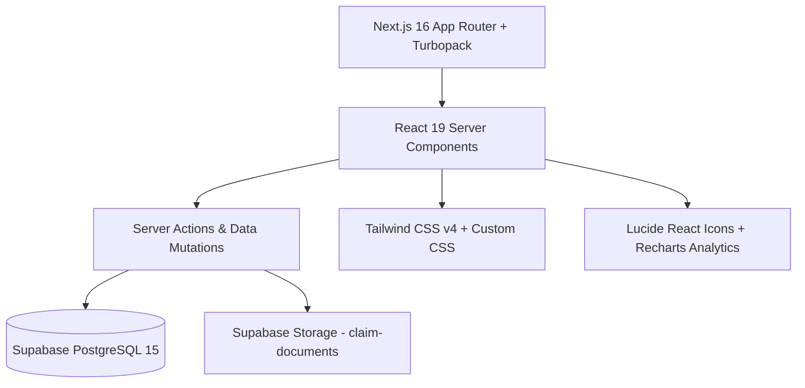

<div align="center">

# 🏛️ PPSU — FRIC Portal
### *Faculty Research Incentive Scheme & Multi-Level Governance Platform*

<p align="center">
  <a href="#-overview"><strong>Overview »</strong></a> ·
  <a href="#-system-credentials"><strong>System Credentials »</strong></a> ·
  <a href="#-credential-naming-conventions"><strong>Naming Rules »</strong></a> ·
  <a href="#-workflow-pipeline"><strong>Verification Flow »</strong></a> ·
  <a href="#-quick-start"><strong>Quick Start »</strong></a>
</p>

[](https://nextjs.org/)
[](https://react.dev/)
[](https://www.typescriptlang.org/)
[](https://tailwindcss.com/)
[](https://supabase.com/)
[](#-security--isolation)

<br />

---

</div>

## 🌟 Overview

The **FRIC Portal** (*Faculty Research Incentive Scheme*) is an enterprise-grade academic research claim management and governance platform engineered specifically for **P. P. Savani University (PPSU)**.

It streamlines the entire lifecycle of faculty research incentives—from initial claim submission and file uploads to a strict **5-stage sequential verification pipeline**, dynamic self-submission bypass rules, and final **Provost payout sanctioning**.

```
┌────────────────────────────────────────────────────────────────────────────────────────┐
│                                                                                        │
│   👨‍🏫 Faculty Member (Submit Claim & Supporting Documents)                               │
│          │                                                                             │
│          ▼                                                                             │
│   🏢 Stage 1: Department Head / Principal Review (HOD SOE / SOS)                      │
│          │                                                                             │
│          ▼                                                                             │
│   📖 Stage 2: Research Committee Member 1 (Ramesh Gohil)                               │
│          │                                                                             │
│          ▼                                                                             │
│   👥 Stage 3: Research Committee Member 2 (Aeshish Rana)                               │
│          │                                                                             │
│          ▼                                                                             │
│   🛡️ Stage 4: Research Committee Convenor / Governor (Rishal Singh)                   │
│          │                                                                             │
│          ▼                                                                             │
│   👑 Stage 5: Provost Final Sanction & Incentive Payout Approval (EAtoVC) (₹)          │
│                                                                                        │
└────────────────────────────────────────────────────────────────────────────────────────┘
```

---

## 👥 System Credentials

All user accounts have been initialized and verified in Supabase Auth & Database.

### 🏢 1. School of Engineering (SOE)
| Name | Designation / Role | Login Email | Password |
|:---|:---|:---|:---|
| **Mitul** | Head of Department (HOD SOE) | `mitul@hod.soe.ppsu.in` | `Mitul@SOE2026!` |
| **Raviraj** | Assistant Professor - SOE | `raviraj@soe.ppsu.in` | `Raviraj@SOE2026!` |
| **Maulika** | Assistant Professor - SOE | `maulika@soe.ppsu.in` | `Maulika@SOE2026!` |
| **Bhavisha** | Assistant Professor - SOE | `bhavisha@soe.ppsu.in` | `Bhavisha@SOE2026!` |
| **Deepak** | Assistant Professor - SOE | `deepak@soe.ppsu.in` | `Deepak@SOE2026!` |
| **Megha** | Assistant Professor - SOE | `megha@soe.ppsu.in` | `Megha@SOE2026!` |

### 🔬 2. School of Science (SOS)
| Name | Designation / Role | Login Email | Password |
|:---|:---|:---|:---|
| **Neha** | Head of Department (HOD SOS) | `neha@hod.sos.ppsu.in` | `Neha@SOS2026!` |
| **Siddharth** | Assistant Professor - SOS | `siddharth@sos.ppsu.in` | `Siddharth@SOS2026!` |
| **Rakesh Kumar** | Assistant Professor - SOS | `rakeshkumar@sos.ppsu.in` | `Rakeshkumar@SOS2026!` |
| **Snkit** | Assistant Professor - SOS | `snkit@sos.ppsu.in` | `Snkit@SOS2026!` |
| **Sneha** | Assistant Professor - SOS | `sneha@sos.ppsu.in` | `Sneha@SOS2026!` |
| **Balraj** | Assistant Professor - SOS | `balraj@sos.ppsu.in` | `Balraj@SOS2026!` |

### ⚖️ 3. Research Committee & Verifiers
| Name | Workflow Stage / Role | Login Email | Password |
|:---|:---|:---|:---|
| **Ramesh Gohil** | Member 1 (`COMMITTEE_M1`) | `rameshgohil@verifer.1.ppsu.in` | `Rameshgohil@Verifier2026!` |
| **Aeshish Rana** | Member 2 (`COMMITTEE_M2`) | `aeshishrana@verifer.2.ppsu.in` | `Aeshishrana@Verifier2026!` |
| **Rishal Singh** | Convenor / Governor (`GOVERNOR`) | `rishalsingh@verifer.convenor.ppsu.in` | `Rishalsingh@Verifier2026!` |

### 👑 4. Executive Administration & Provost
| Name | Designation / Role | Login Email | Password |
|:---|:---|:---|:---|
| **Niraj Shah** | Dean SOE / Super Admin | `admin@ppsu.in` | `Admin@PPSU2026!` |
| **EAtoVC** | Executive Assistant to VC / Provost | `EAtoVC@ppsu.in` | `EAtoVC@PPSU2026!` |

---

## 📐 Credential Naming Conventions

The system follows a strict, predictable email structure across all departments and authorities:

- **Faculty Members**: `name@(department).ppsu.in`  
  *Example*: `raviraj@soe.ppsu.in`, `siddharth@sos.ppsu.in`
- **Head of Department (HOD)**: `name@hod.(department).ppsu.in`  
  *Example*: `mitul@hod.soe.ppsu.in`, `neha@hod.sos.ppsu.in`
- **Verifiers / Committee Members**: `name@verifer.(member_number_or_role).ppsu.in`  
  *Example*: `rameshgohil@verifer.1.ppsu.in`, `aeshishrana@verifer.2.ppsu.in`, `rishalsingh@verifer.convenor.ppsu.in`
- **Provost**: `EAtoVC@ppsu.in`
- **Super Admin**: `admin@ppsu.in`

---

## 🔒 Security & Workflow Rules

### 1. Sequential Stage Isolation
- **No Early Visibility**: Higher authorities in the workflow cannot view or access documents until all lower verification stages have been approved.
- **Department Isolation**: HODs only see research claims submitted by faculty belonging to their department.
- **Self-Review Prevention**: Reviewers are automatically prevented from approving their own research submissions.

### 2. Dynamic Bypass Hierarchy
When an authority submits their own research claim, the workflow automatically skips their stage and routes directly to the next level:
- **Faculty Claim** ➔ Department HOD Review ➔ Member 1 ➔ Member 2 ➔ Convenor ➔ Provost Sanction
- **HOD Submits** ➔ Committee Member 1 ➔ Member 2 ➔ Convenor ➔ Provost Sanction
- **Member 1 Submits** ➔ Committee Member 2 ➔ Convenor ➔ Provost Sanction
- **Member 2 Submits** ➔ Convenor / Governor ➔ Provost Sanction
- **Convenor Submits** ➔ Provost Sanction

---

## 🛠️ Technology Stack



- **Framework**: Next.js 16.3.0 (Turbopack), React 19.2.8, TypeScript 5
- **Styling**: Tailwind CSS v4, Glassmorphism, Custom CSS Variables, Lucide Icons
- **Database & Auth**: Supabase (PostgreSQL 15), Row Level Security (RLS)
- **Object Storage**: Private bucket `claim-documents` with signed preview URLs

---

## 🚀 Quick Start & Seeding

### 1. Clone & Install
```bash
git clone https://github.com/your-username/fric-app.git
cd fric-app
npm install
```

### 2. Configure Environment Variables
Create `.env.local` based on `.env.local.example`:
```env
NEXT_PUBLIC_SUPABASE_URL=https://pvgkulxvmaagtvqgzzan.supabase.co
NEXT_PUBLIC_SUPABASE_ANON_KEY=your-anon-key-here
SUPABASE_SERVICE_ROLE_KEY=your-service-role-key-here

SUPER_ADMIN_EMAIL=admin@ppsu.in
SUPER_ADMIN_PASSWORD=Admin@PPSU2026!
ADMIN_SESSION_SECRET=fric-admin-secret-key-2026-ppsu-demo
```

### 3. Seed Database & Re-initialize Accounts
To re-seed or update all credentials and departments at any time:
```bash
npx tsx scripts/seed_demo_users.ts
```

### 4. Launch Development Server
```bash
npm run dev
```
Open [http://localhost:3000](http://localhost:3000) to log in.

---

<div align="center">

**Crafted for P. P. Savani University (PPSU)**  
*Excellence in Research Governance & Academic Innovation*

</div>
